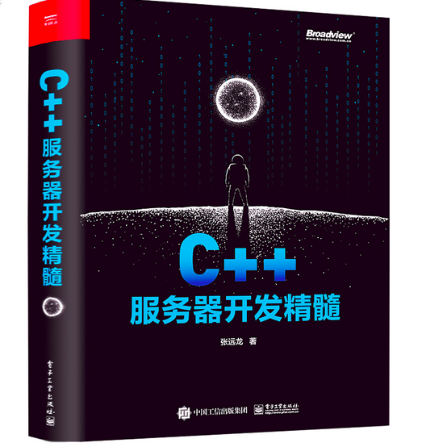

# 1.看书

今天终于历时一个月将c++服务器开发精髓看完了，我辞职前的工作就是c++服务器开发。当时开发的时候这本书还没看完，但是里面很多思路跟我实际开发的时候是一样的。再次从书里看到又温习了一遍。

讲道理来说，这本书讲的真的很不错。不止讲c++，包括应用层协议设计，调试，不同平台的编程等等。算是服务器开发一本很好的中文入门书了，在C++这块。当然在一些工程优化细节上肯定还不够，可以做一些一般性能开发问题不大了。

