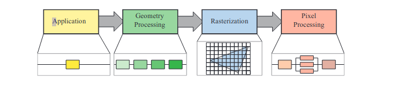
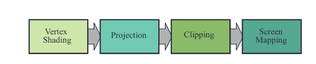

# 实时渲染笔记---失业时代

## 序

-   写作原由

因为我马上就要裸辞失业了，也没有找到工作。突然一个知乎网友联系我，说可以帮着内推游戏引擎相关的开发岗位。在此之前，我就有打算想往游戏方面做一做。约定一周之后再谈，这一周我学习一下相关的opengl和实时渲染

 
Real-Time Rendering真的是一部大部头书籍。一周时间我肯定不可能完全看完。但是我也希望通过一周的时间，让自己对这个领域有一个全面和直观的认识，所以我不仅要看书，还要看参考文件，甚至直接用C++实现相关的算法，并在自己的电脑上看一看效果，调试一下。

想想就很有意思吧，但是真的很有挑战性，而且直接看英文，好久都不这么做了有点生疏。不知道效率行不行。

总之试一试吧

相关的代码会放在
https://github.com/mingtiancai/Real-Time-Rendering-Cpp17

加油吧，少年！

 - 本文档思路

肯定不是中文翻译，因为要翻译，肯定就要翻译好。我目前连基本的概念都不全，也就翻译不好甚至很多认识都是错误的。另外翻译涉及很多技术相关层面之外的内容。目前追求速度和效果。所以不是中文翻译。

一部分是笔记，阅读该书的思路整理还有总结。当然我并不想让这个文档只局限在这一点上，我想把这本书展开。
因为仅仅翻译肯定很多人做，内卷就不好了。但是展开甚至直接复现相关算法，并做分析，就需要技术工地和软件强大的编码，设计架构相关的知识了。这样子比较有意思吧。尽量做出一些可以展示的视频动画，甚至对比不同的算法效果。这样的锻炼才真正贴近我自己给自己设定的，世界级别的软件工程师目标。

# 正文

# 1. 简介

实时渲染的根本问题就是在观看物体视角变化的过程中，快速的生成新的图像，让人眼看到的效果，尽可能少的受到这种不连续变化的影响。图像的呈现流畅，逼真，自然。

 - FPS 每秒帧数，游戏中真正有实际意义帧数一般30，60，72或者更高，虚拟现实的应用一般不低于90FPS

 硬件提升很快，并且对实时渲染带来很大的影响和发展。

## 1.1 行文简介

## 1.2 约定和定义

### 1.2.1 数学约定
一些常用符号表示
so easy

反正切的C基础数学函数：
arctan是-pi/2到pi/2
atan2返回范围0到2*pi

atan2更普适，还可以避免分母为0的情况自己处理

对数默认使用自然对数

### 1.2.2 几何定义
so easy

### 1.2.3 着色
就是画图

书籍相关资源网站：realtimerendering.com

## 2 图形渲染管线

### 2.1 架构
用三明治例子解释并行加速，自行脑补原理，反正早就会了

应用->几何处理->光栅化->像素处理

管线的单个组件本身有可能是并行执行的，然后自己计算出来结果给下一个组件使用，本阶段没有完成之前下阶段需要等待。

管线组件每部还可以有不同的子组件，组件之间可以串行也可以并行。

应用部分的程序跑在cpu上，各种多线程加速啥的我肯定懂。做一些碰撞检测，全局算法加速，动画，物理仿真

几何处理部分主要是计算坐标变换，投影等，这个阶段主要解决哪些内容要被后面画出来的问题。几何处理在gpu上计算，

光栅化就是输入三个点，组成一个三角形，然后将在三角形内的点给下一阶段着色像素计算使用，

像素处理主要计算每个像素的值，确定其颜色，并且通过深度测试确定可见性

### 2.2 应用阶段

应用阶段主要使用cpu完成，一些子步骤也可以使用gpu完成。

### 2.3 几何处理

